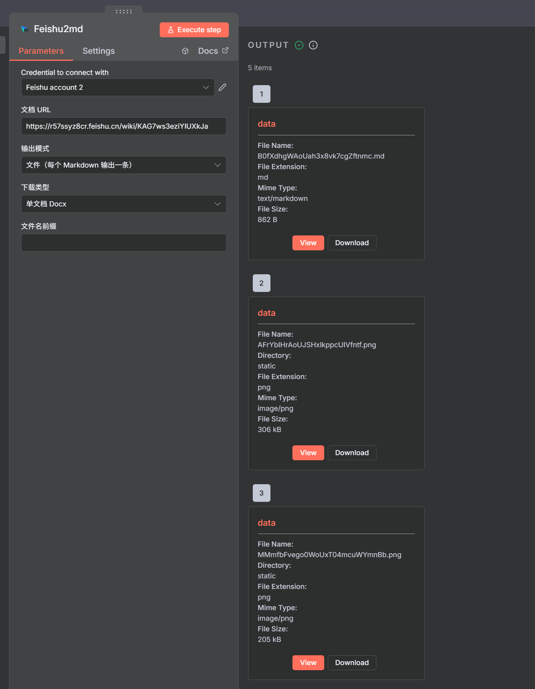

# n8n-飞书2md

一个让你在 n8n 里一键把飞书文档导出为 Markdown 的节点。它内置对 `feishu2md` 的调用，几乎“零配置”就能用。

## 效果展示



## 这是什么

- 在 n8n 工作流中，输入飞书文档的链接，自动下载并生成 Markdown。
- 支持两种输出方式：
  - `Zip（推荐）`：打包 Markdown 和图片资源，一次拿走。
  - `文件`：每个 Markdown 文件作为一条输出，同时会附带图片资源（位于 `static/`）。
- 使用 n8n 的凭据传入 `App ID` 和 `App Secret`，节点会自动执行 `feishu2md config`。

## 你需要准备什么（1分钟搞定）

- 一个可读的飞书文档链接（打开“链接分享：互联网上可读”）。
- 飞书开放平台应用的 `App ID` 和 `App Secret`（用于 API 授权）。
- `feishu2md` 可执行文件：
  - 本仓库已附带多平台版本，放在 `bin/` 目录下（优先使用）。
  - 或者你在系统 `PATH` 中已经安装了 `feishu2md`。

## 安装到 n8n（两步）

1. 在项目目录执行：
   ```
   npm install
   npm run build
   ```
2. 将编译后的包按 n8n 的“自定义节点”方式加载（常见做法：在 n8n 环境中 `npm install <本项目路径>`，或将 `dist` 放到自定义节点目录）。

## 安装教程

- 参考官方文档：<https://docs.n8n.io/integrations/community-nodes/installation/>
- 节点包名称：`n8n-nodes-feishu2md`
- 简要流程：在 n8n 设置中启用“社区节点”，按上述文档安装并重启 n8n，即可在节点面板中搜索到本节点。

## 在 n8n 中使用（一步步来）

1. 新建凭据：在 n8n 的 Credentials 创建 `Feishu API`，填写 `App ID` 和 `App Secret`。
2. 加节点：把 `Feishu2md` 节点拖进工作流。
3. 填参数：
   - `文档 URL`：粘贴飞书文档链接。
   - `输出模式`：选 `Zip（推荐）` 或 `文件`。
   - `文件名前缀`：需要的话填一个前缀（可为空）。
4. 运行：
   - 选 `Zip` 时，节点输出一个 zip（二进制）包含 Markdown 和所有资源。
   - 选 `文件` 时，节点会把每个 Markdown 作为一条输出，同时把图片资源也作为文件项输出，路径形如 `static/xxx.png`。

## 文件与图片在哪里

- 节点下载生成的内容默认写入当前工作目录（相对路径 `./`）。
- 图片统一放在 `./static/` 文件夹下，Markdown 中的图片路径已指向该目录（例如 `static/abc.png`）。
- 选择 `文件` 输出时，节点还会把 `static/` 中的图片作为额外的二进制文件项输出，便于后续保存或传递。

## 常见问题（FAQ）

- 节点提示找不到 `feishu2md` 怎么办？
  - 确认本项目 `bin/` 里有对应平台的可执行文件；或你已在系统 `PATH` 中安装了 `feishu2md`。
- 链接必须“互联网上可读”吗？
  - 是的，至少需要开启链接分享可读，否则下载会失败。
- 我只要 Markdown 和图片，其他不要，怎么打包？
  - 选 `Zip` 输出即可；如果你要自定义打包内容，可以在工作流中用后续节点自己挑选和压缩文件。

## 原理（懂一点就好）

节点内部做了两件事：

- 先用你提供的 `App ID` 与 `App Secret` 执行一次 `feishu2md config`。
- 再执行 `feishu2md dl -o ./ <url>` 下载文档；下载后把 Markdown 和 `static/` 内的图片作为二进制输出给 n8n。

## 致谢

- CLI 工具来自开源项目：Wsine/feishu2md（https://github.com/Wsine/feishu2md）。
- 非常感谢该项目及其作者、贡献者的长期维护与付出，让本节点得以稳定可靠地工作。

## 许可

MIT
